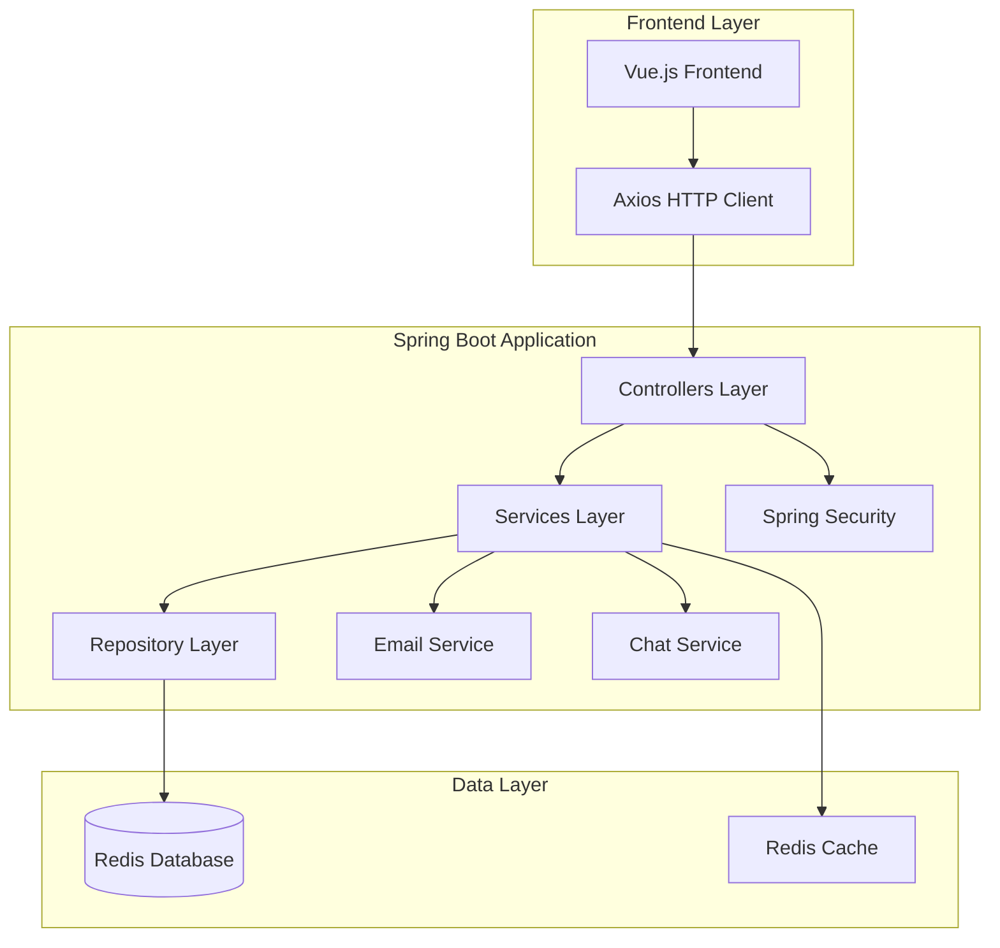

# Design Document - Employee Management System

## Overview

The Employee Management System is a comprehensive enterprise-grade HR management solution built with Spring Boot 3.5.3 and Java 24. The system provides role-based access control, employee information management, department processing, payroll management, and communication features. It follows a layered architecture pattern with clear separation of concerns and leverages Spring Boot's auto-configuration capabilities.

## Architecture

### System Architecture



### Technology Stack Integration

- **Backend**: Spring Boot 3.5.3 with Java 24
- **Security**: Spring Security for authentication and authorization
- **Database**: Redis for data persistence and caching
- **Email**: Spring Boot Mail with Freemarker templates
- **Build**: Maven with standard Spring Boot structure
- **Deployment**: WAR packaging for external servlet containers

## Components and Interfaces

### 1. Security and Permission Management

#### Permission Management Components
```java
// Core permission entities
@Entity
public class Resource {
    private Long id;
    private String name;
    private String url;
    private String method;
    private String description;
}

@Entity
public class Role {
    private Long id;
    private String name;
    private String description;
    private Set<Resource> resources;
}

@Entity
public class User {
    private Long id;
    private String username;
    private String password;
    private Set<Role> roles;
    private boolean enabled;
}
```

#### Security Configuration
```java
@Configuration
@EnableWebSecurity
public class SecurityConfig {
    @Bean
    public SecurityFilterChain filterChain(HttpSecurity http);
    
    @Bean
    public PasswordEncoder passwordEncoder();
    
    @Bean
    public AuthenticationManager authenticationManager();
}
```

### 2. Department Management

#### Department Entity and Service
```java
@Entity
public class Department {
    private Long id;
    private String name;
    private String depPath;
    private Long parentId;
    private Boolean isParent;
    private List<Department> children;
}

@Service
public class DepartmentService {
    public List<Department> getDepartmentTree();
    public Department createDepartment(Department department);
    public void updateDepartment(Department department);
    public void deleteDepartment(Long id);
}
```

### 3. Employee Management

#### Employee Entity and Related Services
```java
@Entity
public class Employee {
    private Long id;
    private String employeeNumber;
    private String name;
    private String email;
    private String phone;
    private Department department;
    private Position position;
    private LocalDate hireDate;
    private EmployeeStatus status;
}

@Service
public class EmployeeService {
    public Page<Employee> getEmployees(Pageable pageable, EmployeeSearchCriteria criteria);
    public Employee createEmployee(Employee employee);
    public void updateEmployee(Employee employee);
    public void deleteEmployees(List<Long> ids);
    public List<Employee> importFromExcel(MultipartFile file);
    public byte[] exportToExcel(List<Long> employeeIds);
}
```

### 4. Position and Title Management

#### Position Management Components
```java
@Entity
public class Position {
    private Long id;
    private String jobTitle;
    private String professionalTitle;
    private String description;
    private Department department;
}

@Service
public class PositionService {
    public List<Position> getAllPositions();
    public Position createPosition(Position position);
    public void updatePosition(Position position);
    public void deletePosition(Long id);
}
```

### 5. Communication System

#### Email Service
```java
@Service
public class EmailService {
    @Async
    public void sendTemplatedEmail(String to, String template, Map<String, Object> variables);
    
    @Async
    public void sendBulkEmails(List<String> recipients, String template, Map<String, Object> variables);
}
```

#### Chat and Notification System
```java
@Entity
public class MessageContent {
    private Long id;
    private String content;
    private LocalDateTime createdAt;
    private Long senderId;
    private MessageType type;
}

@Entity
public class SystemMessage {
    private Long id;
    private Long userId;
    private Long messageId;
    private Boolean isRead;
    private LocalDateTime readAt;
}

@Service
public class NotificationService {
    public void createNotification(Long userId, String content);
    public List<SystemMessage> getUserNotifications(Long userId);
    public void markAsRead(Long messageId, Long userId);
}
```

### 6. Payroll Management

#### Payroll Components
```java
@Entity
public class PayrollLedger {
    private Long id;
    private Long employeeId;
    private BigDecimal baseSalary;
    private BigDecimal allowances;
    private BigDecimal deductions;
    private BigDecimal netSalary;
    private LocalDate payPeriod;
}

@Service
public class PayrollService {
    public PayrollLedger createPayrollLedger(PayrollLedger ledger);
    public PayrollLedger getPayrollLedger(Long id);
    public void updatePayrollLedger(PayrollLedger ledger);
    public List<PayrollLedger> getEmployeePayrollHistory(Long employeeId);
}
```

## Data Models

### Database Schema Design

#### Core Tables Structure
```sql
-- User Management
users (id, username, password, enabled, created_at, updated_at)
roles (id, name, description, created_at, updated_at)
resources (id, name, url, method, description, created_at, updated_at)
user_roles (user_id, role_id)
role_resources (role_id, resource_id)

-- Organization Structure
departments (id, name, dep_path, parent_id, is_parent, created_at, updated_at)
positions (id, job_title, professional_title, description, department_id, created_at, updated_at)

-- Employee Management
employees (id, employee_number, name, email, phone, department_id, position_id, hire_date, status, created_at, updated_at)

-- Communication
msgcontent (id, content, created_at, sender_id, message_type)
sysmsg (id, user_id, message_id, is_read, read_at, created_at)

-- Payroll
payroll_ledgers (id, employee_id, base_salary, allowances, deductions, net_salary, pay_period, created_at, updated_at)
```

### Redis Data Structure

#### Caching Strategy
```java
// Session management
"session:{sessionId}" -> UserSession object

// Permission caching
"user:permissions:{userId}" -> Set<String> permissions

// Department tree caching
"department:tree" -> Department tree structure

// Employee search cache
"employee:search:{hash}" -> Page<Employee> results
```

## Error Handling

### Unified Exception Handling

#### Global Exception Handler
```java
@ControllerAdvice
public class GlobalExceptionHandler {
    @ExceptionHandler(ValidationException.class)
    public ResponseEntity<ErrorResponse> handleValidation(ValidationException ex);
    
    @ExceptionHandler(AccessDeniedException.class)
    public ResponseEntity<ErrorResponse> handleAccessDenied(AccessDeniedException ex);
    
    @ExceptionHandler(DataIntegrityViolationException.class)
    public ResponseEntity<ErrorResponse> handleDataIntegrity(DataIntegrityViolationException ex);
    
    @ExceptionHandler(Exception.class)
    public ResponseEntity<ErrorResponse> handleGeneral(Exception ex);
}
```

#### Custom Exception Types
```java
public class EmployeeNotFoundException extends RuntimeException;
public class DepartmentHierarchyException extends RuntimeException;
public class PayrollCalculationException extends RuntimeException;
public class EmailSendingException extends RuntimeException;
public class ImportValidationException extends RuntimeException;
```

### Frontend Error Handling

#### Axios Interceptor Configuration
```javascript
// Request interceptor for authentication
axios.interceptors.request.use(config => {
    const token = localStorage.getItem('token');
    if (token) {
        config.headers.Authorization = `Bearer ${token}`;
    }
    return config;
});

// Response interceptor for error handling
axios.interceptors.response.use(
    response => response,
    error => {
        if (error.response.status === 401) {
            // Handle authentication errors
        } else if (error.response.status === 403) {
            // Handle authorization errors
        }
        return Promise.reject(error);
    }
);
```

## Testing Strategy

### Unit Testing Approach

#### Service Layer Testing
```java
@ExtendWith(MockitoExtension.class)
class EmployeeServiceTest {
    @Mock
    private EmployeeRepository employeeRepository;
    
    @InjectMocks
    private EmployeeService employeeService;
    
    @Test
    void shouldCreateEmployeeSuccessfully();
    
    @Test
    void shouldThrowExceptionWhenEmployeeNumberExists();
}
```

#### Repository Testing
```java
@DataRedisTest
class EmployeeRepositoryTest {
    @Autowired
    private TestEntityManager entityManager;
    
    @Autowired
    private EmployeeRepository employeeRepository;
    
    @Test
    void shouldFindEmployeesByDepartment();
    
    @Test
    void shouldSupportPaginationAndSorting();
}
```

### Integration Testing

#### Web Layer Testing
```java
@SpringBootTest
@AutoConfigureTestDatabase
class EmployeeControllerIntegrationTest {
    @Autowired
    private MockMvc mockMvc;
    
    @Test
    @WithMockUser(roles = "HR_MANAGER")
    void shouldCreateEmployeeWithValidData();
    
    @Test
    @WithMockUser(roles = "EMPLOYEE")
    void shouldDenyAccessToRestrictedEndpoints();
}
```

### Security Testing

#### Authentication and Authorization Tests
```java
@SpringBootTest
@AutoConfigureTestDatabase
class SecurityIntegrationTest {
    @Test
    void shouldAuthenticateValidUser();
    
    @Test
    void shouldDenyAccessWithoutPermission();
    
    @Test
    void shouldLoadUserPermissionsDynamically();
}
```

### Performance Testing

#### Load Testing Strategy
- Use JMeter for API endpoint load testing
- Test concurrent user scenarios for chat functionality
- Validate database performance with large datasets
- Monitor Redis cache hit rates and performance

### Email and Notification Testing

#### Async Service Testing
```java
@SpringBootTest
class EmailServiceTest {
    @MockBean
    private JavaMailSender mailSender;
    
    @Test
    void shouldSendTemplatedEmailAsynchronously();
    
    @Test
    void shouldHandleEmailSendingFailures();
}
```

## Implementation Considerations

### Security Implementation
- Use Spring Security's method-level security for fine-grained access control
- Implement JWT tokens for stateless authentication
- Store user sessions in Redis for scalability
- Use BCrypt for password hashing

### Performance Optimization
- Implement Redis caching for frequently accessed data
- Use database connection pooling
- Implement pagination for large datasets
- Use async processing for email sending

### Scalability Considerations
- Design stateless services for horizontal scaling
- Use Redis for distributed caching
- Implement proper database indexing
- Use connection pooling for database access

### Monitoring and Logging
- Use Spring Boot Actuator for health checks and metrics
- Implement structured logging with appropriate log levels
- Monitor Redis performance and memory usage
- Track email sending success/failure rates