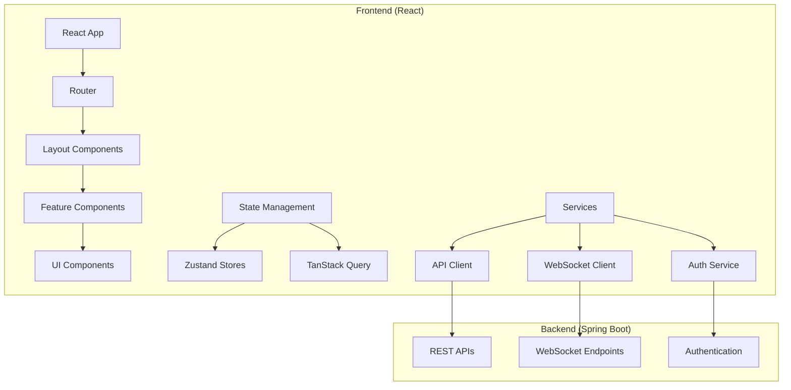

# React Frontend Design Document

## Overview

This document outlines the design for a modern React frontend application that interfaces with the existing Spring Boot employee management system. The frontend will be built using React 18+ with TypeScript, providing a responsive, accessible, and feature-rich user interface for managing employees, departments, authentication, real-time chat, email communications, notifications, payroll, and permissions.

The application will follow modern React patterns including functional components, hooks, and a component-driven architecture. It will implement real-time features using WebSocket connections and provide an intuitive user experience across desktop and mobile devices.

## Architecture

### High-Level Architecture



### Technology Stack

- **Core Framework**: React 18+ with TypeScript
- **Build Tool**: Vite for fast development and optimized builds
- **State Management**: 
  - Zustand for global state management
  - TanStack Query (React Query) for server state management
- **UI Library**: Mantine for comprehensive component library
- **Routing**: React Router v6 for client-side routing
- **Real-time Communication**: Socket.IO client for WebSocket connections
- **Form Management**: React Hook Form with Zod validation
- **Styling**: CSS Modules with Mantine's theming system
- **Testing**: Vitest + React Testing Library
- **Code Quality**: ESLint + Prettier + TypeScript strict mode

### Project Structure

```
src/
├── components/           # Reusable UI components
│   ├── ui/              # Basic UI components
│   ├── forms/           # Form components
│   └── layout/          # Layout components
├── features/            # Feature-based modules
│   ├── auth/            # Authentication feature
│   ├── employees/       # Employee management
│   ├── departments/     # Department management
│   ├── chat/            # Chat functionality
│   ├── email/           # Email management
│   ├── notifications/   # Notification system
│   └── permissions/     # Permission management
├── hooks/               # Custom React hooks
├── services/            # API and external services
├── stores/              # Zustand stores
├── types/               # TypeScript type definitions
├── utils/               # Utility functions
├── constants/           # Application constants
└── assets/              # Static assets
```

## Components and Interfaces

### Core Layout Components

#### AppShell
- **Purpose**: Main application wrapper with navigation and header
- **Props**: `user: User`, `children: ReactNode`
- **Features**: Responsive sidebar, header with notifications, user menu
- **State**: Navigation collapse state, theme preferences

#### Navigation
- **Purpose**: Role-based navigation menu
- **Props**: `userRoles: string[]`, `collapsed: boolean`
- **Features**: Hierarchical menu structure, active route highlighting
- **Permissions**: Dynamic menu items based on user permissions

#### Header
- **Purpose**: Top navigation bar with user actions
- **Props**: `user: User`, `notificationCount: number`
- **Features**: Search bar, notification dropdown, user profile menu
- **Actions**: Logout, profile settings, theme toggle

### Feature Components

#### Authentication Module

**LoginForm**
- **Props**: `onSubmit: (credentials: LoginRequest) => void`
- **Validation**: Email format, password requirements
- **Features**: Remember me, forgot password link, loading states

**RegisterForm**
- **Props**: `onSubmit: (data: RegisterRequest) => void`
- **Validation**: Email uniqueness, password confirmation, required fields
- **Features**: Real-time validation, terms acceptance

#### Employee Management Module

**EmployeeList**
- **Props**: `employees: Employee[]`, `loading: boolean`, `onEdit: (id: number) => void`
- **Features**: Pagination, sorting, filtering, bulk actions
- **Search**: Multi-criteria search with debounced input

**EmployeeForm**
- **Props**: `employee?: Employee`, `onSubmit: (data: Employee) => void`
- **Validation**: Required fields, email format, phone format
- **Features**: File upload for profile picture, department selection

**EmployeeImport**
- **Props**: `onImport: (file: File) => void`
- **Features**: Drag-and-drop file upload, template download, validation preview

#### Department Management Module

**DepartmentTree**
- **Props**: `departments: Department[]`, `onSelect: (dept: Department) => void`
- **Features**: Expandable tree view, drag-and-drop reordering
- **Actions**: Add, edit, delete, move departments

**DepartmentForm**
- **Props**: `department?: Department`, `parentOptions: Department[]`
- **Validation**: Name uniqueness, parent relationship validation
- **Features**: Parent department selection, description editor

#### Chat Module

**ChatInterface**
- **Props**: `currentUser: User`
- **Features**: Real-time messaging, conversation list, message history
- **WebSocket**: Live message updates, typing indicators, online status

**ConversationList**
- **Props**: `conversations: Conversation[]`, `unreadCounts: Record<string, number>`
- **Features**: Search conversations, unread badges, last message preview

**MessageInput**
- **Props**: `onSend: (message: string) => void`, `disabled: boolean`
- **Features**: Emoji picker, file attachments, message formatting

#### Email Module

**EmailComposer**
- **Props**: `templates: EmailTemplate[]`, `recipients: User[]`
- **Features**: Template selection, recipient picker, variable substitution
- **Validation**: Recipient validation, content requirements

**EmailTemplateSelector**
- **Props**: `templates: EmailTemplate[]`, `onSelect: (template: EmailTemplate) => void`
- **Features**: Template preview, variable documentation

#### Notification Module

**NotificationDropdown**
- **Props**: `notifications: Notification[]`, `onMarkRead: (id: number) => void`
- **Features**: Real-time updates, mark as read, notification grouping

**NotificationItem**
- **Props**: `notification: Notification`, `onClick: () => void`
- **Features**: Icon based on type, timestamp formatting, read status

### UI Components

#### DataTable
- **Props**: `data: T[]`, `columns: Column<T>[]`, `pagination: PaginationConfig`
- **Features**: Sorting, filtering, row selection, export functionality
- **Accessibility**: Keyboard navigation, screen reader support

#### FormField
- **Props**: `label: string`, `error?: string`, `required?: boolean`, `children: ReactNode`
- **Features**: Error display, required indicator, help text
- **Validation**: Integration with React Hook Form

#### LoadingSpinner
- **Props**: `size?: 'sm' | 'md' | 'lg'`, `overlay?: boolean`
- **Features**: Multiple sizes, overlay mode for full-page loading
- **Accessibility**: Proper ARIA labels

## Data Models

### Core Types

```typescript
interface User {
  id: number;
  username: string;
  email: string;
  firstName?: string;
  lastName?: string;
  roles: Role[];
  enabled: boolean;
  createdAt: string;
  updatedAt: string;
}

interface Employee {
  id: number;
  employeeNumber: string;
  firstName: string;
  lastName: string;
  email: string;
  phone?: string;
  department: Department;
  position: Position;
  hireDate: string;
  salary?: number;
  status: EmployeeStatus;
  profilePicture?: string;
}

interface Department {
  id: number;
  name: string;
  description?: string;
  parentId?: number;
  children?: Department[];
  employeeCount: number;
  createdAt: string;
}

interface ChatMessage {
  id: number;
  content: string;
  senderId: number;
  senderName: string;
  recipientId: number;
  recipientName: string;
  createdAt: string;
  read: boolean;
}

interface Notification {
  id: number;
  title: string;
  message: string;
  type: NotificationType;
  userId: number;
  read: boolean;
  createdAt: string;
  actionUrl?: string;
}
```

### API Response Types

```typescript
interface ApiResponse<T> {
  data: T;
  message?: string;
  success: boolean;
}

interface PaginatedResponse<T> {
  content: T[];
  totalElements: number;
  totalPages: number;
  size: number;
  number: number;
  first: boolean;
  last: boolean;
}

interface AuthResponse {
  token: string;
  id: number;
  username: string;
  email: string;
  roles: string[];
}
```

## Error Handling

### Error Boundary Strategy

```typescript
interface ErrorBoundaryState {
  hasError: boolean;
  error?: Error;
  errorInfo?: ErrorInfo;
}

class AppErrorBoundary extends Component<PropsWithChildren, ErrorBoundaryState> {
  // Catch JavaScript errors anywhere in the child component tree
  // Log error details and display fallback UI
  // Provide error reporting functionality
}
```

### API Error Handling

- **Network Errors**: Display retry mechanism with exponential backoff
- **Authentication Errors**: Automatic token refresh or redirect to login
- **Validation Errors**: Field-level error display with clear messaging
- **Server Errors**: User-friendly error messages with error codes
- **Rate Limiting**: Queue requests and display appropriate feedback

### Form Validation

```typescript
const employeeSchema = z.object({
  firstName: z.string().min(1, "First name is required"),
  lastName: z.string().min(1, "Last name is required"),
  email: z.string().email("Invalid email format"),
  phone: z.string().optional(),
  departmentId: z.number().min(1, "Department is required"),
  hireDate: z.string().min(1, "Hire date is required")
});
```

## Testing Strategy

### Unit Testing
- **Components**: Test rendering, props handling, user interactions
- **Hooks**: Test custom hook logic and state management
- **Services**: Test API calls, data transformation, error handling
- **Utilities**: Test helper functions and data manipulation

### Integration Testing
- **Feature Flows**: Test complete user workflows
- **API Integration**: Test service layer integration with mock APIs
- **State Management**: Test store interactions and data flow

### E2E Testing
- **Critical Paths**: Authentication, employee CRUD, chat functionality
- **Cross-browser**: Ensure compatibility across major browsers
- **Responsive**: Test mobile and desktop layouts

### Testing Tools
- **Vitest**: Fast unit test runner with TypeScript support
- **React Testing Library**: Component testing with user-centric approach
- **MSW**: Mock Service Worker for API mocking
- **Playwright**: End-to-end testing framework

## Performance Optimization

### Code Splitting
- **Route-based**: Lazy load feature modules
- **Component-based**: Dynamic imports for heavy components
- **Library-based**: Separate vendor bundles for better caching

### State Management Optimization
- **Selective Subscriptions**: Use Zustand selectors to prevent unnecessary re-renders
- **Query Optimization**: Implement proper caching strategies with TanStack Query
- **Memoization**: Use React.memo and useMemo for expensive computations

### Bundle Optimization
- **Tree Shaking**: Remove unused code from final bundle
- **Asset Optimization**: Compress images and optimize static assets
- **CDN Integration**: Serve static assets from CDN for better performance

### Real-time Performance
- **WebSocket Management**: Implement connection pooling and automatic reconnection
- **Message Batching**: Batch multiple updates to reduce re-renders
- **Virtual Scrolling**: Implement for large lists (chat history, employee lists)

## Security Considerations

### Authentication & Authorization
- **JWT Storage**: Secure token storage using httpOnly cookies or secure localStorage
- **Token Refresh**: Automatic token refresh with proper error handling
- **Role-based Access**: Component-level permission checks
- **Route Protection**: Protected routes based on user roles

### Data Security
- **Input Sanitization**: Sanitize all user inputs to prevent XSS
- **CSRF Protection**: Implement CSRF tokens for state-changing operations
- **Content Security Policy**: Implement CSP headers to prevent code injection
- **Sensitive Data**: Mask sensitive information in forms and displays

### API Security
- **Request Validation**: Validate all API requests on the client side
- **Error Information**: Avoid exposing sensitive error information
- **Rate Limiting**: Implement client-side rate limiting for API calls
- **HTTPS Only**: Ensure all communications use HTTPS

## Accessibility Features

### WCAG 2.1 Compliance
- **Keyboard Navigation**: Full keyboard accessibility for all interactive elements
- **Screen Reader Support**: Proper ARIA labels and descriptions
- **Color Contrast**: Ensure sufficient color contrast ratios
- **Focus Management**: Proper focus indicators and management

### Responsive Design
- **Mobile First**: Design for mobile devices first, then enhance for desktop
- **Touch Targets**: Ensure touch targets are at least 44px in size
- **Viewport Meta**: Proper viewport configuration for mobile devices
- **Flexible Layouts**: Use CSS Grid and Flexbox for responsive layouts

### Internationalization
- **Text Externalization**: All user-facing text in translation files
- **RTL Support**: Support for right-to-left languages
- **Date/Time Formatting**: Locale-aware date and time formatting
- **Number Formatting**: Locale-aware number and currency formatting