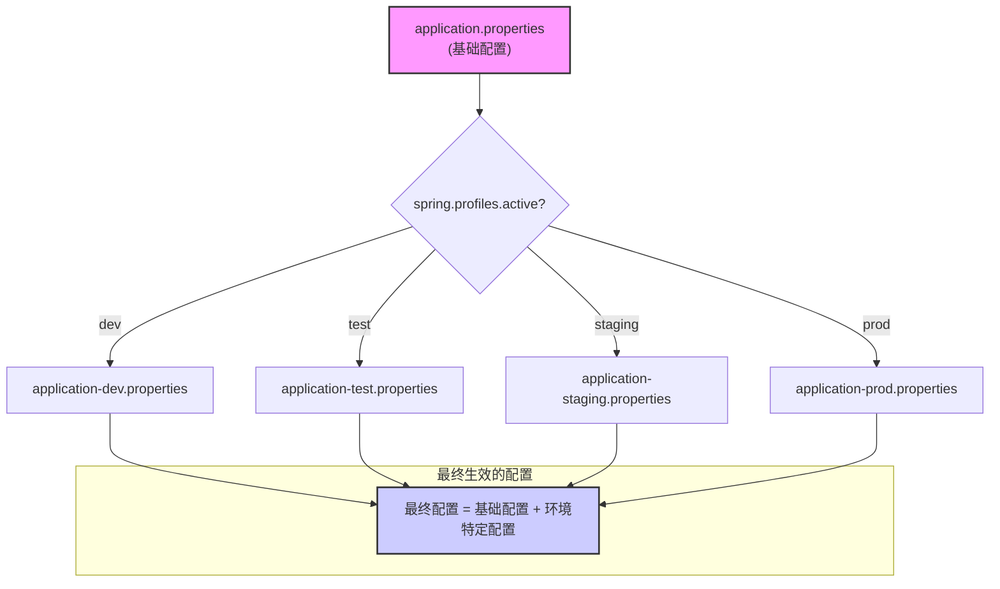

# Spring Boot 配置说明 (修订版)

本目录 (`src/main/resources`) 存放 Spring Boot 应用的核心配置文件。这些文件定义了应用在不同环境下的行为。

## 配置文件概览

- `application.properties`: 主配置文件，包含所有环境共享的通用设置。
- `application-dev.properties`: **开发环境**的特定配置。
- `application-test.properties`: **测试环境**的特定配置。
- `application-staging.properties`: **预发/灰度环境**的特定配置。
- `application-prod.properties`: **生产环境**的特定配置。
- `ftl/`: 存放 [FreeMarker](https://freemarker.apache.org/) 模板文件 (`.ftl`) 的目录，用于生成动态内容，如本项目中的员工通知邮件 (`ftl/email/employee/announcement.ftl`)。

## 配置加载机制

Spring Boot 使用 "profile" 机制来管理多环境配置。其工作流程如下：

1. **加载基础配置**: 应用首先加载 `application.properties` 文件。
2. **激活特定环境**: 在 `application.properties` 中，通过 `spring.profiles.active=${SPRING_PROFILES_ACTIVE:dev}` 指定默认激活 `dev` 环境。这个值可以通过启动参数（如 `-Dspring.profiles.active=prod`）或环境变量来覆盖。
3. **加载环境特定配置**: Spring Boot 会加载与激活的 profile 相对应的配置文件（例如 `application-dev.properties`）。
4. **配置覆盖**: 环境特定配置文件中的属性会**覆盖** `application.properties` 中的同名属性。

### 可视化流程

## 各环境详解

### `application.properties` (通用配置)

- **作用**: 定义所有环境共享的默认值、应用信息和业务规则。
- **具体配置示例**:
  - `spring.application.name=employee-management-system`: 定义了应用的名称。
  - `info.app.version=@project.version@`: 应用版本号会从 Maven/Gradle 项目中自动获取。
  - `app.features.chat.enabled=true`: 使用功能开关（Feature Flags）来控制应用内的聊天功能是否开启。
  - `app.business.max-employees-per-department=1000`: 定义了具体的业务规则，如每个部门的最大员工数。

### `application-dev.properties` (开发环境)

- **目标**: 方便开发者本地调试，追求快速启动和详尽的日志。
- **具体配置示例**:
  - `spring.datasource.url=jdbc:h2:mem:employeedb`: 使用 H2 内存数据库，无需安装外部数据库，方便快速启动和测试。
  - `spring.h2.console.enabled=true`: 开启 H2 数据库的 Web 控制台，方便在浏览器中查看和操作数据。
  - `spring.jpa.show-sql=true`: 在控制台打印执行的 SQL 语句，便于调试数据库操作。
  - `logging.level.com.example.demo=DEBUG`: 将项目自身代码的日志级别设为 `DEBUG`，以获得最详细的日志信息。

### `application-test.properties` (测试环境)

- **目标**: 为自动化测试提供一个干净、隔离、可重复的环境。
- **具体配置示例**:
  - `server.port=0`: 使用一个随机的可用端口启动服务，避免在并行测试时发生端口冲突。
  - `spring.jpa.hibernate.ddl-auto=create-drop`: 在测试开始时自动创建数据库表，在测试结束时自动删除，确保每次测试都在一个全新的数据库环境中进行。
  - `spring.datasource.url=jdbc:h2:mem:testdb;...`: 使用一个名为 `testdb` 的独立内存数据库，与开发环境的 `employeedb` 隔离。
  - `spring.mail.port=3025`: 将邮件服务指向一个模拟端口，测试邮件功能时不会发送真实邮件。

### `application-staging.properties` (预发环境)

- **目标**: 模拟生产环境，用于上线前的最后集成测试和验证。
- **具体配置示例**:
  - `spring.datasource.url=...employeedb_staging`: 连接到一个独立的预发数据库，其结构与生产库一致，但数据是测试数据。
  - `spring.mail.host=smtp.mailtrap.io`: 使用 Mailtrap 这类邮件测试服务，可以捕获所有发出的邮件进行验证，而不会发送给真实用户。
  - `app.cors.allowed-origins=...https://staging.yourdomain.com`: 允许来自预发环境前端域名的跨域请求。
  - `logging.file.name=.../employee-management-staging/application.log`: 将日志输出到预发环境专属的日志文件中。

### `application-prod.properties` (生产环境)

- **目标**: 应用正式运行的环境，追求稳定、安全和高性能。
- **具体配置示例**:
  - `spring.datasource.url=${DATABASE_URL:...}`: **关键安全实践**。数据库连接字符串通过环境变量注入，避免将敏感信息硬编码在代码库中。
  - `app.jwt.secret=${JWT_SECRET:}`: **关键安全实践**。JWT 签名密钥必须通过环境变量提供，绝不能在文件中明文存储。
  - `spring.jpa.hibernate.ddl-auto=validate`: 校验实体类和数据库表结构是否匹配，但绝不自动修改数据库结构，防止意外的数据丢失。
  - `logging.level.root=WARN`: 默认日志级别设为 `WARN`，只记录警告和错误信息，以减少生产环境的日志量和 I/O 压力。
  - `server.error.include-message=never`: 关闭详细的错误信息返回，防止向客户端泄露潜在的系统内部信息。
